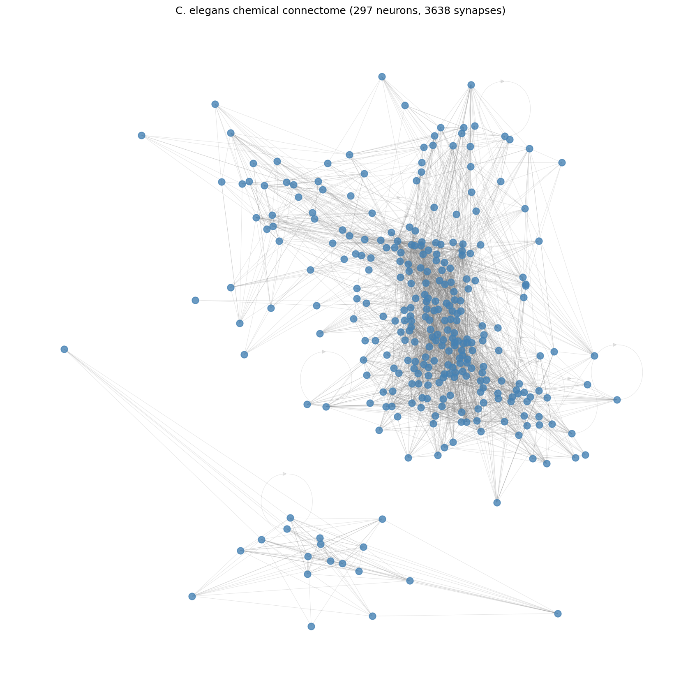

# Predicting Neural Circuit Fragility with Graph Neural Networks

A small summer project exploring whether graph neural networks can predict which neurons in the C. elegans nervous system are critical, meaning their failure cascades to disrupt large parts of the network, better than classical graph centrality measures can.

## The question

When a single neuron stops working, what happens to the rest of the
network? Most knockouts produce a small effect, but a few cause large
cascades. Can we predict which neurons are critical from the wiring
diagram alone?

Two model families address this differently. Classical graph
centrality measures (degree, betweenness, PageRank, etc.) give each
neuron an "importance" score. Graph neural networks (GNNs)
learn their own features from the local structure around each neuron.
This project tests whether the GNN approach beats centralities on a
real connectome.



## What's in the repository

- **`connectome_model.py`** — loads the C. elegans chemical connectome
  (297 neurons, 3,638 synapses), runs a linear-threshold dynamics
  simulator, and generates a "cascade severity" label for each neuron
  by simulating its knockout.
- **`baselines.py`** — computes 5 classical centrality measures for
  every neuron (in-degree, out-degree, betweenness, eigenvector,
  PageRank).
- **`train_baselines.py`** — trains linear regression and gradient
  boosting models to predict cascade severity from centralities.
- **`train_gnn.py`** — trains a 2-layer Graph Convolutional Network
  (GCN) on the same task using PyTorch Geometric.
- **`train_gnn_experiments.py`** — 3 regularization experiments
  testing why the GCN underperformed: minimal features (Experiment A),
  reduced dropout (B), and a single GCN layer (C). All variants are
  reported, not just the best.
- **`error_analysis.py`** — compares per-neuron errors between the
  linear baseline and the GCN to understand where each model fails.

## Key findings

- The C. elegans chemical connectome decomposes into a 275-neuron
  strongly-connected core + 22 peripheral feeder neurons (mostly
  the pharyngeal cluster).
- Cascade severity has a 17-fold spread across neurons. The most
  critical neurons are the backward-locomotion command interneurons
  (AVAL, AVAR), plus a handful of sensory neurons and bottleneck
  interneurons.
- A linear regression on five centralities achieves R² ≈ 0.51, which is a
  strong baseline. Out-degree alone explains 75% of the model's
  feature importance.
- A 2-layer GCN does not beat this baseline. Across multiple
  regularization variants the GCN achieves R² ≈ 0.32-0.35.
- Error analysis shows the two models make highly correlated errors
  (residual correlation 0.74). They fail on the same neurons, mostly
  sensory neurons whose simulated criticality comes from being
  "clamped" input sources, a property the features don't encode.

The takeaway: Improving cascade prediction on this dataset would
likely require better features (e.g. explicitly flagging sensory
neurons) rather than more sophisticated model architectures.


## How to reproduce

Setup:

```bash
conda create -n neuro-gnn python=3.11 -y
conda activate neuro-gnn
pip install pandas numpy scipy networkx matplotlib scikit-learn
pip install torch torch_geometric
```

Run in this order:

```bash
python connectome_model.py
python baselines.py
python train_baselines.py
python train_gnn.py
python error_analysis.py
```

Connectome data is downloaded automatically on first run from
[OpenWorm](https://github.com/openworm/CElegansNeuroML).

## Future scope

I am currently working on extending this project in two directions:

**Better features for cascade prediction.** The error analysis showed
that both baselines and the GCN systematically under-predict sensory
neurons — their criticality comes from being clamped input sources,
which the centralities and graph topology alone do not encode. The
immediate next step is adding an explicit "sensory neuron" feature
and a separate "downstream-of-sensory" feature to see how much of the
residual error closes.

**Model comparison fork.** The current project answers one specific
question — does a GCN beat centralities? A separate forked repository
will broaden the question: what is the best achievable prediction
from local network structure, comparing GCNs (GraphSAGE, GAT, GIN)
against tree ensembles, MLPs, and ensembled approaches under a
matched hyperparameter-tuning protocol. This new repository would aim to address "what is the
ceiling here?" rather than "does this one model help?"

Longer-term directions I find genuinely interesting:

- **Gap junctions and signed weights.** The current connectome uses
  chemical synapses only and treats all as excitatory. Adding the
  electrical (gap-junction) network and inhibitory information from
  recent C. elegans literature would make the dynamics model more
  biologically faithful and might surface different critical
  neurons.

- **Pairwise and k-node knockouts.** Real biological failures often
  involve multiple neurons. Predicting which *combinations* cause
  catastrophic cascades is a richer and less-studied problem than
  single-neuron criticality.

- **Other connectomes.** The same pipeline would work on the
  Drosophila hemibrain or full FlyWire connectome, which became
  available in their complete forms in 2024. A natural question is
  whether the patterns found in C. elegans generalize to a 100x
  larger nervous system.

- **The inverse problem.** Rather than predicting cascade severity
  from neuron identity, ask: given a desired downstream effect, what
  is the minimum set of neurons to perturb? This connects to network
  controllability and has analogues in therapeutic targeting, a area I find particuarly compelling.

## Acknowledgements

This project was developed with the assistance of Claude (Anthropic)
for explanation of GNN concepts, debugging, and report drafting.
All experimental choices, code execution, and final interpretations
are my own.

## References and resources

- Stanford CS224W: Machine Learning with Graphs (Leskovec) - YouTube Lectures.
- PyTorch Geometric documentation: https://pytorch-geometric.readthedocs.io/

## 👩‍💻 Author
Mrunmayee Wankhede \
MS-QBB @ CMU
