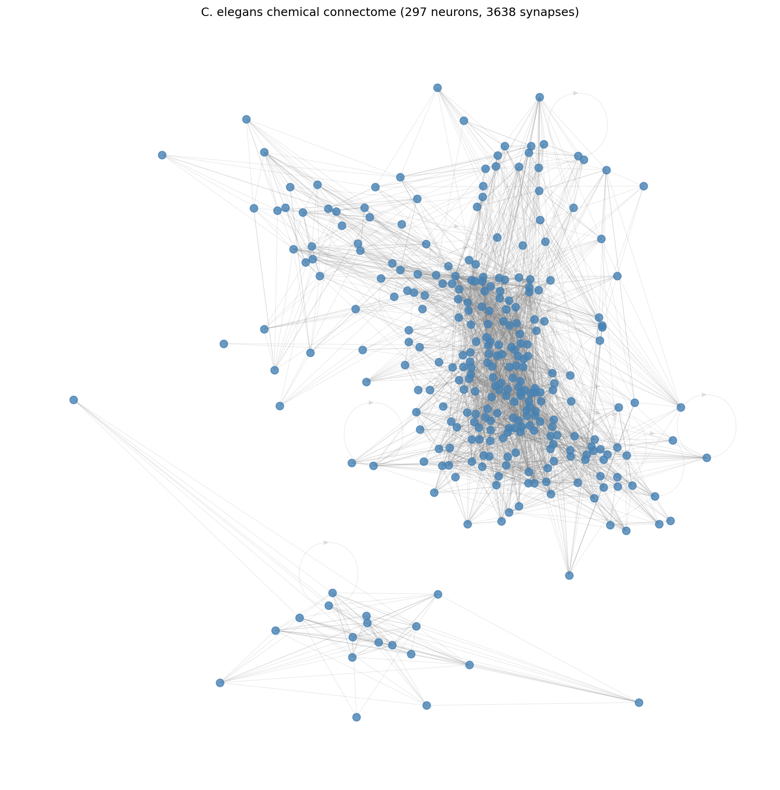

# Predicting Neural Circuit Fragility with Graph Neural Networks

When a neuron stops working, what happens to the rest of the nervous system? Most
neurons barely matter when removed. A few cause large cascades. This project tries to
predict which is which from the wiring diagram alone.

I built a perturbation-propagation model over the *C. elegans* connectome, used it to
generate a "criticality" score for every neuron by simulating its knockout, and tested
whether a graph neural network could predict those scores better than classical graph
centrality measures.

Short version: The GCN lost at first. Auditing why led to finding that the benchmark
itself was broken. 73% of the prediction target was recoverable in closed form, so no
model could have learned much from it. After redesigning the task, the GCN wins, but
only once message passing is oriented the right way. That direction mattered more than
which model I used.


## 1. The biological system

### Why *C. elegans*

*Caenorhabditis elegans* is a soil nematode about a millimetre long, and the only animal
whose entire nervous system has been mapped at the level of individual synapses. It has
exactly 302 neurons, and every one has a name (e.g. AVAL, PVCR, DD03) that refers to the
same cell in every individual worm — cell number and identity are invariant across
animals.

That makes "the connectome" a concrete, finite object: a directed graph with a few
hundred nodes and a few thousand edges, small enough to fit in a CSV. That's why it's
the standard connectome for computational work on neural circuits.

### Two kinds of connection

Neurons connect in two ways, and the distinction determines how the graph gets built.

**Chemical synapses** are one-way — the presynaptic neuron releases neurotransmitter,
the postsynaptic neuron has receptors, and signal flows in one direction. These become
*directed* edges.

**Gap junctions** are direct electrical couplings where current flows both ways. These
would be *undirected* edges.

I used **chemical synapses only**. Mixing the two into one directed graph would encode
bidirectional connections as if they had a direction. Excluding gap junctions is a real
simplification — they matter, particularly in the motor circuit — and it's listed under
limitations below.

### Three functional classes

**Sensory neurons** detect the outside world — touch, chemicals, temperature, oxygen.
They're the input.

**Motor neurons** drive muscles. Everything the worm does — crawling forward,
reversing, turning — is motor neuron activity. They're the output.

**Interneurons** sit in between. Some are well known: AVA, AVB, AVD, and PVC are the
*command interneurons*, a small set of cells that integrate sensory input and decide
whether the animal moves forward or backward. These come up repeatedly below as a
validation check, since the pipeline finds them without being told they're special.

### The data

The edge list comes from the [OpenWorm](https://github.com/openworm/CElegansNeuroML)
project, a curated version of the White *et al.* (1986) reconstruction with later
corrections. It downloads automatically on first run.

The raw file lists 449 cells, not 302, because it includes muscle cells and other
non-neuronal targets. I filtered these out using three rules: (i) names matching the
muscle pattern `M[DV][LR]\d+`, (ii) names containing `BWM` (body wall muscle), and
(iii) names containing any lowercase letter (real neuron names are entirely uppercase).

After filtering to chemical synapses between neurons:

- **297 nodes** (neurons)
- **3,638 directed edges** (weighted by synapse count)



## 2. The model

### What the simulator does

I needed a working definition of "critical". The approach: build a simple model of
activity spreading through the network, knock out each neuron in turn, and measure the
damage.

Every neuron has an activity value. 25 sensory neurons are **clamped** to 1.0,
representing constant sensory stimulation. Everything else starts at 0. Then one rule
applies repeatedly:

```
x  ←  tanh(W x)
```

Each neuron looks at everything feeding into it, sums that activity weighted by
connection strength, squashes the result through `tanh`, and adopts that as its new
activity. The sensory clamp gets reapplied each iteration. This repeats until values
stop changing — the **steady state**.

To score a neuron: force its activity to 0 permanently, run to steady state again, and
compare against the healthy steady state. The total change is that neuron's **cascade
severity**.

Do this for all 297 neurons and you get a dataset — neuron in, severity out. That's the
prediction task.

### The matrix convention

`W` is built so that

```
W[i, j] = strength of the synapse from j into i
```

Note the reversal relative to the edge list: an edge `u → v` in the CSV becomes
`W[index[v], index[u]]`.

This creates an asymmetry that turns out to matter a lot later:

- **Row `i`** holds everything flowing *into* neuron `i`. The update rule `Wx` walks
  along rows.
- **Column `j`** holds everything flowing *out of* neuron `j`. A knockout removes a
  column's worth of influence.

So the update is a row operation, and a knockout is a column operation.

### Row normalisation

Each row of `W` is divided by its sum, so every neuron's total incoming weight equals
1. Without this, a neuron receiving 200 synapses would be driven far harder than one
receiving 5, and a few hubs would dominate the dynamics.

I didn't anticipate a side effect of this choice — Section 4 covers what it caused.

### Workflow

```
Load connectome (OpenWorm edge list)
      ↓
Filter to neurons + chemical synapses  →  297 nodes, 3638 edges
      ↓
Build W, apply GABAergic signs, row-normalise by |w|
      ↓
Clamp 25 sensory neurons, iterate to steady state
      ↓
Knock out each neuron in turn  →  cascade severity at motor readout
      ↓
Audit: is the label closed-form?  →  validate labels
      ↓
Train models (Linear, GBM, GCN)  →  paired comparison
```

## 3. The prediction task

Two model families approach this differently.

**Classical centrality measures** assign each neuron a scalar importance score from
graph structure. Degree counts connections. Betweenness counts how many shortest paths
run through a node. Eigenvector centrality and PageRank measure connection to other
well-connected nodes. I computed 5 of these and fed them to linear regression and
gradient boosting.

**Graph neural networks** skip hand-designed features. A GCN aggregates information
from each node's neighbours repeatedly — 1 layer covers 1 hop, building its own
representation of each node's structural context.

My expectation going in was that the GCN, with direct access to graph structure rather
than five summary statistics, would do better.

## 4. Version 1, and the audit

### The original result

| model | R² |
|---|---|
| Linear regression, 5 centralities | 0.51 |
| 2-layer GCN | ~0.33 |

The GCN lost, consistently, across several regularisation variants.

Error analysis at the time turned up something useful: both model families made
**highly correlated errors** (residual correlation 0.74) and failed on the same
neurons, mostly sensory ones. When two structurally different models fail on the same
points, that usually signals missing information rather than insufficient capacity. I
concluded that better *features* were the bottleneck.

That instinct was right, but I was missing one further step: writing out the algebra of
the update rule to see what the label actually was.

### The question to ask before comparing models

If a label can be computed in closed form from the inputs, no model can learn anything
from it — any apparent difference between architectures is just noise around an
expression that was sitting there the whole time.

For a linear system this can be checked by hand, and this system turns out to be nearly
linear. Because every row of `W` sums to 1 and every activity is in [0, 1], the argument
to `tanh` is always a weighted *average* of values in [0, 1], which is never large.
Measured on the actual network: median input 0.486, and `tanh` deviates from a straight
line by only 8.9%.

So the model was written as a nonlinear system, but it was behaving as a nearly linear
one.

### The derivation

**Step 1.** Neuron `j` sits at activity `x_j`. Neuron `i` receives from it through
`W[i,j]`. The signal `i` gets from `j` is `W[i,j] · x_j`.

**Step 2.** Kill `j`. Its activity drops to zero, so `i` loses that entire contribution.
`x_j` here is the *healthy* value — the height of the fall is the size of the damage.

**Step 3.** Severity sums the loss over the whole network, so sum over all `i`:

```
severity(j)  =  Σᵢ W[i,j] · x_j
```

**Step 4.** As `i` ranges over the network, `W[i,j]` changes but `x_j` doesn't — it
carries no `i` index — so it factors out:

```
severity(j)  ≈  x_j × Σᵢ W[i,j]  =  baseline activity × outgoing column sum
```

Two numbers multiplied together. No model, no training required.

### The test

| predictor | CV R² |
|---|---|
| **closed form, zero parameters** | **0.730** |
| Linear regression, 5 centralities | 0.515 |
| 2-layer GCN | ~0.33 |

Spearman correlation between the closed form and the labels: 0.93.

An expression requiring no model beat every model in the study. The task was
**degenerate** — roughly three quarters of the target variance was a two-term product,
and none of the models had both terms. The centralities contained the second term
(out-degree ≈ outgoing column sum) but none contained the first.

**The sensory neuron mystery:** a clamped sensory neuron has `x_j = 1.0` exactly, the
largest value in the network. Its outgoing column sum is often modest — AVM's is 1.25
against AVAR's 7.2 — so centralities rank it unremarkable, but the *product* is large.
Both models under-predicted sensory neurons because both were missing the same factor.
The fix isn't a binary "is sensory" flag but **baseline steady-state activity as a
continuous feature**, which the simulator already computes.

**A pairwise-knockout extension that found nothing:** it couldn't have found anything.
Super-additivity requires a threshold, and `tanh` in its near-linear regime has none. In
a linear system, double knockouts are additive by construction. Measured over 200 hub
pairs, the median interaction was 0.51% of the additive expectation.


## 5. What fixed it

### Motor-neuron readout — the actual fix

"How much did the whole network change" sounds integrative, but it isn't. Almost all
damage lands on neurons directly downstream of the knockout, so the question reduces to
*how much does this neuron send out* — a local property with a closed-form answer.

Measuring at a fixed **output population** changes the question. For a neuron that
doesn't synapse directly onto that population, the effect has to travel through
intermediates, along paths that may converge or cancel. Whether influence *reaches a
destination* isn't proportional to how much influence a neuron has in total.

I used the **93 motor neurons** as the readout: ventral cord classes (VA, VB, DA, DB,
AS, VC, DD, VD) and head motor classes (RMD, RME, SMD, SMB).

Two reasons for this choice. Biologically, motor neurons drive muscles and muscles
produce behaviour, so the metric answers *how much does losing this neuron impair what
the worm can do* — summed activity over all neurons has no such reading.
Methodologically, it forces the question to be about paths rather than degree.

| task variant | closed-form R² |
|---|---|
| unsigned, global readout — v1 | 0.730 |
| signed, global readout | 0.740 |
| unsigned, motor readout | 0.130 |
| signed, motor readout | 0.156 |
| signed, motor readout, self-excluded | 0.280 |

### Self-exclusion

93 of the 297 neurons are themselves in the readout set. When one gets knocked out, its
own activity drops to 0, and that was getting counted as part of its severity — 62.6% of
a typical motor neuron's score was just its own removal, not a neuron damaging the
motor system.

Rankings correlate at r = 0.96 either way, so this is a correctness fix rather than a
dramatic one.

### Log-transformed target

Severity is heavy-tailed — median 0.23, with AVAL and AVAR at 5.0 and 5.4. Since R² is
computed against test-set variance, results ended up depending on which fold those two
landed in:

| fold type | Linear R² |
|---|---|
| contains AVAL or AVAR (18 folds) | +0.605 |
| does not (32 folds) | +0.171 |

The reported average was basically a mixture of two regimes decided by a coin flip.
Predicting `log(1 + severity)` fixes this: linear regression goes from 0.327 ± 0.263 to
0.492 ± 0.107 — higher and far more stable, with no negative folds.

### Signed edges — kept, but didn't help

All 26 GABAergic neurons (DD01-06, VD01-13, RMED/V/L/R, AVL, DVB, RIS) got negative
outgoing weight, with row normalisation switched to sum of *absolute* weights.

My prediction at the time was that this would be the decisive fix, since inhibition
makes the system non-monotone and no centrality can represent a sign that depends on
molecular identity.

The dynamics did change — 275 of 297 knockouts now cause activity to increase
somewhere — but the closed-form R² went from 0.730 to 0.740. Slightly worse, if
anything.

The reason: the closed form uses *absolute* outgoing weight. Signs determine which
direction each downstream neuron moves, but the total magnitude of disturbance is still
first-order. Monotonicity was never actually the problem.

I kept the signs anyway, because they're biologically correct — a model of a nervous
system where nothing inhibits anything isn't a model of a nervous system. That's the
reason to keep them, not that they rescued the benchmark.

## 6. Where the damage actually goes

A natural objection: if the simulator computes the full multi-hop cascade, why does a
one-hop formula predict it?

The simulator *is* fully multi-hop — the closed form is an approximation, not the
model. And the indirect component isn't small:

| | share of total activity lost |
|---|---|
| at direct synaptic partners | 40.3% |
| further downstream | 59.7% |

The ripple is the *majority* of the damage, but it correlates with the direct hit at
Pearson 0.764 — it's approximately a scaled copy of the first-order term, because
spreading happens through the same network regardless of where it starts.

So the first-order term explains 73% of label variance despite accounting for only 40%
of the actual damage — not because it captures the ripple, but because the ripple
tracks it.

This is also why a destination-specific readout breaks the shortcut. Counting damage
everywhere catches the ripple wherever it lands, so the constant multiplier holds.
Counting damage only at motor neurons asks whether influence reaches one particular
place, which isn't proportional to its total size.

### The network is shallow

| distance to nearest motor neuron | neurons |
|---|---|
| 0 (is one) | 93 |
| 1 hop | 138 |
| 2 hops | 46 |
| 3 hops | 1 |
| unreachable | 19 |

Median distance is 1 hop, max 3. A 2-layer GCN already reaches essentially the whole
relevant neighbourhood, so any benefit has to come from *how* it aggregates, not how
far. That's what led to Section 8.

## 7. Validating the labels

Two checks that the labels track something real, neither involving a model.

**Bilateral symmetry.** Most *C. elegans* neurons come in left/right pairs, anatomically
equivalent but reconstructed independently in the original electron microscopy. Across
67 pairs, severity correlates at Pearson 0.962 (Spearman 0.903). If the pipeline were
just measuring reconstruction noise, it wouldn't.

**Known circuit recovery.** The mechanosensory escape circuit wasn't used anywhere in
the pipeline.

| neuron | rank (of 297) | role |
|---|---|---|
| AVAR | 1 | backward command interneuron |
| AVAL | 2 | backward command interneuron |
| PVCR | 3 | forward command interneuron |
| AVM | 5 | anterior gentle-touch receptor |
| AVDR | 6 | command interneuron |
| PVCL | 11 | forward command interneuron |
| AVDL | 12 | command interneuron |
| AVBL | 23 | forward command interneuron |
| ALML | 38 | anterior touch receptor |
| ALMR | 42 | anterior touch receptor |
| AVBR | 50 | forward command interneuron |

All 11 members rank in the top 50 of 297. Under a null where circuit membership is
unrelated to severity, about 2 would be expected.

The internal ordering also makes sense — command interneurons rank far above the touch
receptors feeding them, which fits, since several receptors converge on each command
neuron and losing one leaves the others intact.

*Caveat:* the escape circuit is heavily represented among interneurons projecting to
motor neurons, so with a motor readout, part of this recovery is close to definitional.

## 8. The main finding: message-passing direction

With everything else fixed, the GCN still scored 0.347, below linear regression. The
remaining gap from a reference implementation turned out to be the orientation of
message passing.

In PyTorch Geometric, `edge_index[0]` is the source and `edge_index[1]` the target, and
messages flow **source → target** — each node aggregates from its **predecessors**, the
neurons synapsing *onto* it.

But severity depends on what a neuron **sends out**. The relevant information lives in
its **downstream targets**. The GCN was gathering information about where each neuron's
input comes from, while the task depends on where its output goes.

```python
# before: aggregate from upstream sources
edge_list = [(node_idx[u], node_idx[v]) for u, v in G.edges()]

# after: reverse, so each neuron aggregates from the neurons it synapses ONTO
edge_list = [(node_idx[v], node_idx[u]) for u, v in G.edges()]
```

| message direction | CV R² |
|---|---|
| aggregate from upstream sources (PyG default) | 0.347 |
| **aggregate from downstream targets** | **0.548** |

That's +0.201 from reversing an edge list.

This is the correct inductive bias, not leakage — features and labels are identical
across orientations, so nothing new about the label is exposed.


## 9. Results

All models on log-transformed severity, `RepeatedKFold(n_splits=5, n_repeats=10,
random_state=42)` — identical folds throughout, so comparisons are paired.

| model | CV R² | std |
|---|---|---|
| closed form (no model) | 0.280 | — |
| GBM, v1 hyperparameters | 0.460 | 0.083 |
| Linear regression, 6 features | 0.492 | 0.107 |
| GBM, default | 0.522 | 0.136 |
| **GCN, downstream messages** | **0.548** | 0.117 |
| GCN, upstream messages | 0.347 | 0.114 |

Paired Wilcoxon signed-rank, 50 folds:

| comparison | mean difference | GCN wins | p |
|---|---|---|---|
| GCN − linear regression | +0.056 | 35/50 | 0.0008 |
| GCN − GBM (tuned) | +0.087 | 39/50 | <0.0001 |
| GCN − GBM (default) | +0.025 | 28/50 | 0.25 (n.s.) |

The GCN significantly beats linear regression and the tuned GBM, and ties the default
GBM. Both significant results survive Bonferroni correction.

### The comparison that matters more

| effect | magnitude |
|---|---|
| **message-passing direction** | **+0.201** |
| GCN over tuned GBM | +0.087 |
| GCN over linear regression | +0.056 |
| GCN over default GBM | +0.025 (n.s.) |

Orienting message passing along the causal direction of the perturbation is worth 2.3×
the largest model-class difference and 8× the smallest.

So the headline finding isn't really "do GNNs help" — it's:

> On a directed network with a directional readout, the orientation of message passing
> dominates the choice of architecture. The same GCN moves from clearly worse than
> linear regression to significantly better, depending only on which way the edges
> point.

That generalises: any GNN applied to a directed biological network — regulatory,
metabolic, food web — where the target has a directional interpretation runs into the
same trap, and the library default isn't always right.

### What remains in the residuals

| group | mean residual |
|---|---|
| clamped sensory neurons (25) | +0.007 |
| all others (272) | +0.000 |
| **posterior sensory neurons (12)** | **+0.399** |

The v1 finding is resolved — adding `baseline_activity` closed the sensory gap exactly
as the v1 error analysis predicted. What's left is confined to a handful of tail
neurons — PHA, PHB, PHC, PVD, PQR, PDE — and hop distance doesn't explain it (r = −0.12).
My best guess is anatomical: posterior neurons reach motor output through few dedicated
pathways, chiefly via PVC, while head neurons have redundant routes. Degree-based
features can't see path concentration.

## 10. Silent failure modes

None of these raised an exception. All of them produced plausible-looking numbers while
being wrong.

| issue | effect |
|---|---|
| degenerate label (global readout) | task 73% closed-form |
| unshuffled CV folds — alphabetical order groups by cell class | −0.162 vs +0.188 (raw target) |
| overwritten feature matrix | new feature silently unused |
| outlier-dominated R² | 0.605 vs 0.171 by fold membership |
| `failure_count` threshold never fired | 283/297 zeros; dropped as a target |
| unstandardised GCN features | 0.294 vs 0.463 |
| reversed message-passing direction | 0.347 vs 0.548 |

Every figure quoted in this README is reproduced by `verify_numbers.py`; output in
`results/verified_numbers.txt`.


## 11. Limitations

- **Not a model of neural activity.** No spiking, time constants, synaptic delay, or
  neuromodulation — a perturbation-propagation model producing a static steady state.
- **Gap junctions excluded**; chemical synapses only.
- **Sign assignment is incomplete.** Only the 26 unambiguously GABAergic neurons. In
  *C. elegans*, a glutamatergic synapse is excitatory or inhibitory depending on the
  postsynaptic receptor — AWC→AIY inhibits, AWC→AIB excites — so sign is a property of
  the *pair*, not the neuron, and can't be read from the connectome.
- **Negative activity isn't biologically interpretable.** `tanh` is symmetric about
  zero, so three neurons reach negative steady state (min −0.199). Best read as
  deviation from a baseline rate rather than absolute rate.
- **The gain parameter is arbitrary and matters.** Rank correlation between gain 1 and
  gain 3 is 0.57. AVAL and AVAR stay top-3 at every gain; the rest of the ranking
  doesn't. Gain 1 is used because higher values saturate the network (89% of neurons
  above 0.9 at gain 3).
- **The motor set is defined by string matching on names**, not a curated annotation.
- **19 pharyngeal neurons can't reach the motor set**, so 6% of the dataset has severity
  identically zero.
- **23 of the 26 inhibitory neurons are themselves motor neurons**, so almost all
  inhibition lives inside the readout population.
- **297 nodes is small.** Fold-to-fold std is ~0.1; differences under ~0.05 aren't
  resolvable without paired testing.
- **`baseline_activity` isn't a pure graph feature** — it requires running the dynamics.
  Not leakage (it's computed before any knockout), but the honest claim is "from the
  wiring diagram and the healthy activity state it produces," not "from wiring alone."
- **Eigenvector centrality definition matters.** Performance varies by 0.18 R² across
  five standard variants (0.469–0.649). Reported as a sensitivity, not a tuned choice.

## 12. Repository

| file | purpose |
|---|---|
| `connectome_model.py` | builds the graph, runs the dynamics, generates severity labels |
| `connectome_model_v2.py` | revised model incorporating the Section 5 fixes (motor readout, self-exclusion, log target) |
| `baselines.py` | computes the five centrality measures |
| `train_baseline_models.py` | linear regression and gradient boosting |
| `train_gnn.py` | 2-layer GCN (PyTorch Geometric) |
| `audit_degeneracy.py` | tests whether the label is solvable in closed form |
| `validate_lables.py` | bilateral symmetry and known-circuit checks |
| `verify_numbers.py` | reproduces every number quoted here |
| `compare_models.py` | paired significance tests across models |
| `error_analysis.py` | per-neuron residual comparison |
| `debug.py` | scratch script used for interactive debugging during development |

### Reproducing

```bash
conda create -n neuro-gnn python=3.11 -y
conda activate neuro-gnn
pip install pandas numpy scipy networkx matplotlib scikit-learn torch torch_geometric

python connectome_model.py      # generate labels
python baselines.py             # centralities
python audit_degeneracy.py      # is the task closed-form?
python validate_lables.py       # sanity checks
python train_baseline_models.py
python train_gnn.py
python compare_models.py        # paired tests
```

Connectome data downloads on first run from
[OpenWorm](https://github.com/openworm/CElegansNeuroML).

---

## 13. Next steps

- **Path-based features.** The remaining systematic residual is confined to posterior
  sensory neurons, which reach motor output through few dedicated pathways. Counting
  edge-disjoint paths to the motor set would test this directly.
- **Receptor-dependent synaptic sign.** Deriving edge signs from paired pre- and
  postsynaptic expression (CeNGEN) would test whether wiring alone is sufficient to
  determine circuit function — a claim the current signed model only gestures at.
- **Gap junctions** as a second edge type.
- **Larger connectomes.** The same pipeline would run on the *Drosophila* hemibrain or
  FlyWire. The direction finding in Section 8 predicts orientation should matter there
  too, and more so in a deeper network.

---

## Acknowledgements

Developed with assistance from Claude (Anthropic) for concept explanation, debugging,
and drafting. The closed-form audit was carried out in dialogue; several predictions
made during that process were wrong (notably that signed edges would resolve the
degeneracy) and were corrected by measurement. All experimental choices, code
execution, and final interpretations are my own.

## References

- White, J.G. *et al.* (1986). The structure of the nervous system of the nematode
  *C. elegans*. *Phil. Trans. R. Soc. Lond. B*.
- McIntire, S.L. *et al.* (1993). The GABAergic nervous system of *C. elegans*. *Nature*.
- Stanford CS224W: Machine Learning with Graphs (Leskovec).
- PyTorch Geometric documentation: https://pytorch-geometric.readthedocs.io/

## 👩‍💻 Author
Mrunmayee Wankhede \
MS-QBB @ CMU
