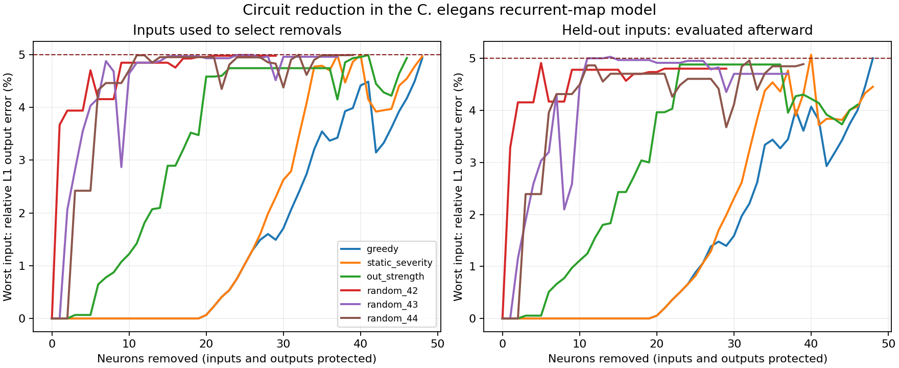

# Circuit-pruning pilot

This is a descriptive experiment on the existing signed recurrent-map model. It is not a biological minimum-circuit claim.

Run command:

```bash
python run_pruning.py --edge-list data/herm_full_edgelist.csv --max-removals 179 --output results/pruning_pilot
```

The CSV matched the pinned OpenWorm SHA-256. Inputs: six fitting patterns and six held-out patterns. Protected: 25 inputs and 93 outputs. Acceptance: at most 5% relative L1 output error for every fitting input.

| Method | Removed | Retained | Worst fitting error | Worst held-out error | Search trajectories |
|---|---:|---:|---:|---:|---:|
| greedy | 48 | 249 | 4.9356% | 5.0021% | 45,576 |
| static_severity | 48 | 249 | 4.9716% | 4.4547% | 3,306 |
| out_strength | 46 | 251 | 4.9391% | 4.1077% | 10,494 |
| random_42 | 29 | 268 | 4.9808% | 4.8024% | 9,966 |
| random_43 | 37 | 260 | 4.9618% | 4.7029% | 14,004 |
| random_44 | 39 | 258 | 4.9939% | 4.8899% | 15,192 |



Every method stopped because no further single removal in its current circuit met the fitting budget. None hit the 179-removal cap. No candidate convergence failures were observed.

Greedy and static severity both removed 48 neurons, including 19 with no directed output path and 29 with such a path. Static severity used about 13.8 times fewer fitting trajectories. Greedy slightly exceeded 5% on the worst held-out input (5.0021%); the circuit was not revised in response. This is one input suite and three random priorities, with no significance claim.

The useful next comparison is a GNN against static severity at matched simulation budgets. The current result does not establish a need for a GNN.

The experiment ran before its source was committed; the manifest records that original working-tree state. Its three implementation-file SHA-256 values were subsequently checked against the committed files. The manifest, summary, removal traces, per-output vectors and curves are retained here so the result can be inspected and reproduced.

See [the experiment guide](../../docs/circuit_pruning.md) for definitions and limitations.
